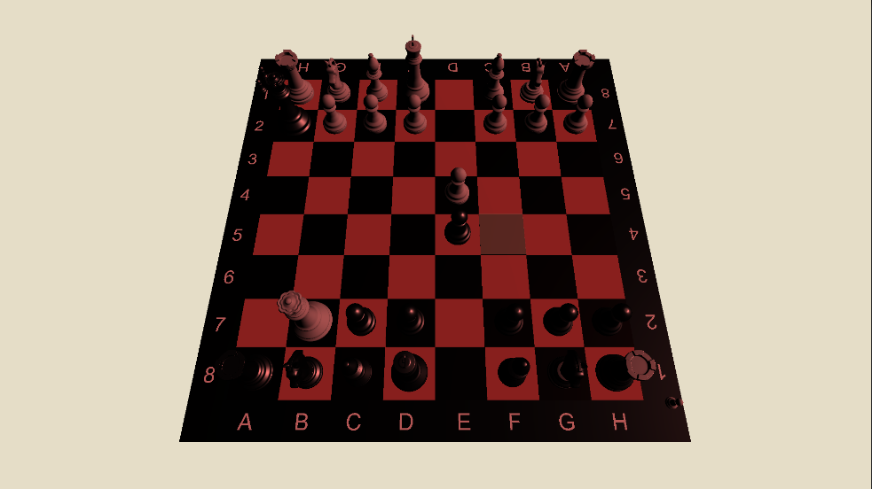

# Momentum Chess 

## Navigation

[Examples of enviroment changes](#examples-of-enviroment-changes-) 
[Assets](#game-assets-linksin-case-someone-wants) 
[Credits](#credits)

This is a university project, where the initial idea was to develop a Chess game where depending on the current state of the game, or momentum(thats where the game name comes from), we change the enviroment lightning and soundtrack of the game to try providing different emotions on the the situation.

## Examples of enviroment changes :

### Beginning of the game
At first the start of the game with normal lightning and a calm background music ongoing.

### Mid game (after 12 plays or so)
Then after some plays the lightning of the game changes to a different color, that could be any sort of animation or anything else but we kept it simple changing the color and the background music.

### End of the game (if theres only 7 or less pieces of one of the teams)
Then after the usual plays and mid game exchanges, there's a moment where starts to get higher chances for getting a check or even a checkmate for the team that has more pieces.

In the end there is nothing too especial about the enviroment changes since we had a limited amount of time to develop ideas and actually develop the game.
The game is entirely made with the unity engine.

## Game assets links(in case someone wants)

Songs used : https://drive.google.com/drive/folders/1BEmo6z4AGs8eNmTqGqv-eV8Pz3KYAovj?usp=sharing  
3D models : https://www.turbosquid.com/3d-models/3d-chess-2086885  

## Credits 
The game was made by :

### Coding and Game Logic Planning 
Igor Raphael - irav@cin.ufpe.br - https://github.com/duckdogersxd  
João Victor - jvpsc@cin.ufpe.br - https://github.com/John-Cavalcanti 
Jorge Junior -  jflj@cin.ufpe.br - https://github.com/jorge-junior 
Tales Vinicius - tvac@cin.ufpe.br  

### UX/UI Design
Raquel Rocha - rroc@cin.ufpe.br  
Tiago Victor - tvas@cin.ufpe.br  

[Back to top](#momentum-chess)
